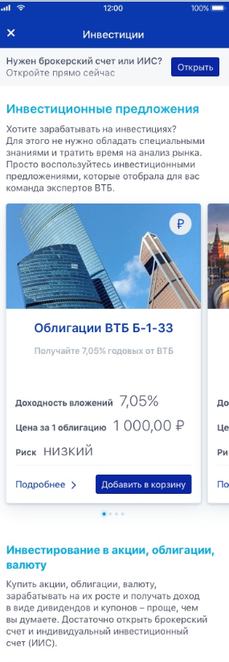

#5.4 Инвестиции
##5.4.1 Форма "Инвестиции"
Пример экранной формы

####Экраннная спецификация формы:
**Заголовок**

1.Значение "Инвестиции" из системного параметра sharedSettings.Investment.Header

**Кнопка назад**
1. При нажатии на кнопку происходит возврат к предыдущей форме FRM 5.4.1 Витрина

**Иконка "Корзина"**
1. Логика отображения состоит из двух этапов: первый этап - функциональные требования Витрины №5;
второй этап- проверка состояния корзины, если корзина пустая, то иконку не отображаем, в противном случае иконка отображается.
2. Отключаемость: Если параметр SessionInfoMto/userSettings/pilotBlocks/BR14797_BuyFinancialInstruments  не получен , то иконка  не отображается.
3. При нажатии отправляется запрос UpdateInvestmentCartRequest и происходит переход на форму "Корзина"
4. Обработка ошибки: Если в ответах на запросы  GetInvestorProfileRequest и UpdateInvestmentCartRequest приходит  Errors c ErrorCodeString=BR14797_SomeCartItemsLost, то выводится окно об ошибке.Текст ошибки берём из  Errors=Message, заголовок sharedSettings.InvestmentFund.IIS1Dis19, название кнопки в параметре на СИ- sharedSettings.InvestmentFundBasket.Button2,  нажатие на кнопку "продолжить покупки" закрывает окно-сообщение.

 **Блок "Инвестиционные предложения ВТБ"**
 1. Блок отображается только при получении в ответе на запрос GetInvestmentContractsResponse statusId= NotAvailable.

* Заголовок: текст приходит как текст для обычного заголовка формы, располагать в соответствии из параметра statusHeader
* Текст описания берется из параметра Description, располагать в соответствии с макетами из параметра statusText
* Ссылка "Карта офисов" - отображаем ссылку, которая из ответа Минервы.

 **Блок "Нужен брокерский счёт или ИИС?"**
1. Заголовок отражается в соответствии со значением параметра id в ContractOpeningService, хранится на СИ:
* Если id=opSrv;IndividualInvestmentContractOpeningScenario;1, то список берется из системного параметра sharedSettings.Investment.bl5Header
* Если id=opSrv;InvestmentContractsOpeningScenario;2,  то список берется из системного параметра sharedSettings.Investment.bl2Header
* Если id=opSrv;BrokerageInvestmentContractOpeningScenario;3,  то список берется из системного параметра sharedSettings.Investment.bl4Header

2 . Текст, значение из системного параметра sharedSettings.Investment.bl2Text

3.Кнопка (наименование из системного параметра sharedSettings.Investment.bl2Button/ функционал аналогичен кнопке старта операции на этой же форме)

4.Если в  ответе на запрос GetInvestmentContractsResponse statusId= NotAvailable или statusId=Active или AvailableForOpening, но ContractOpeningService не заполнен или параметр enabled=false в ContractOpeningService, то блок не отображается.

**Блок "Инвестиционные предложения "**

1. Заголовок, значение из системного параметра sharedSettings.Investment.bl3Header
2. Текст из системного параметра sharedSettings.Investment.bl3Text
3. Элемент не отображается в случае, если в ответе за запрос GetFinancialInstrumentsRequest пришёл пустой список инстурментов, если  SessionInfoMto/userSettings/pilotBlocks/BR14797_BuyFinancialInstruments  не получен
4. Если в ответе на запрос  GetFinancialInstrumentsRequest приходит  Errors , то при любом ErrorCodeString  sharedSettings.Investment.bl3Text не отображается, на его месте отображать текст ошибки из поля Message и пустую карточку инструмента (плейсхолдер)
5. Учесть обработку бб-кодов

**Карусель инструментов**
1. Карусель
* Логика отображения:В ответе на запрос финансовых инструментов GetFinancialInstrumentsRequest(если инструменты не пришли, то отображаем пустую карточку инструмента с плейсхолдером) , необходимые поля в элементе FinancialInstruments, отображается до 6 фондов. Если параметр SessionInfoMto/userSettings/pilotBlocks/BR14797_BuyFinancialInstruments  не получен , то карусель не отображается
* Если в ответе на запрос  GetFinancialInstrumentsRequest приходит  Errors , то при любом ErrorCodeString:
  * вместо карусели выводить плейсхолдер с пустой карточкой инструмента
  * Текст ошибки отображать из поля Message вместо параметра sharedSettings.Investment.bl3Text
* Проверять Visible:
  * true-отображать в карусели инструментов
  * false- не отображать в карусели инструментов
 * Учесть обработку бб-кодов

2 . Карточка фонда
* Должна быть кликабельна карточка полностью с переходом на форму инструмента

3 . Картинка+пиктограмма валюты в сером кругу
* Храним на МП
* Распределение картинок в соответствии с функциональным требованием 4

4 . Название инструмента
* Значение берём из ответа за запрос GetFinancialInstrumentsRequest новый элемент FinancialInstrument/Name

5 . Описание (серый текст)
* Значение берём FinancialInstrument/DisplayParameters /TagLine

6 . Поле "доходность"/"доходность вложений"
* FinancialInstruments/Type=MutualFund:
  *  Текст sharedSettings.InvestmentFund.IIS1Dis11
  * Если это поле FinancialInstrument/IsBaseAssetReturns = true, то показываем "*" после слова "Доходность", если false, то " "(пробел)
  * Год- FinancialInstrument/ReturnsYear
  * Значение-FinancialInstrument/Returns
  * Иконка - вшиваем в МП (зелёная-когда приходит число с минервы без "-", красная, когда число пришло со знаком "-")
* FinancialInstruments/Type=OFZN и FinancialInstruments/Type=Bond
  * Текст sharedSettings.InvestmentOFZnBond.Text
  * Значение BondInfo/Returns
  * Процент МП