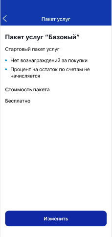

# FRM 6.1 Прочее

### Экранная спецификация формы FRM 6.1

Элемент | Комментарий |
|:-----: | :-----: |
Иконка "Назад" |1. Тип - иконка "стрелка влево" (хранится на стороне МП) 
| | 2. Формат отображения аналогичен стандартной для приложения кнопке "Назад" 
| | 3. По событию нажатия отображается форма FRM 6.1 "Прочее" |
